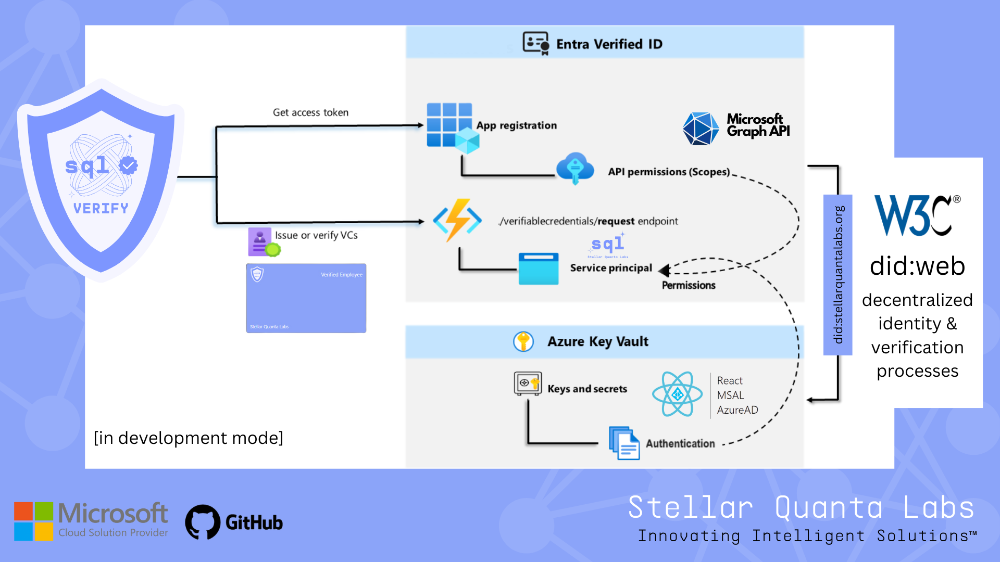
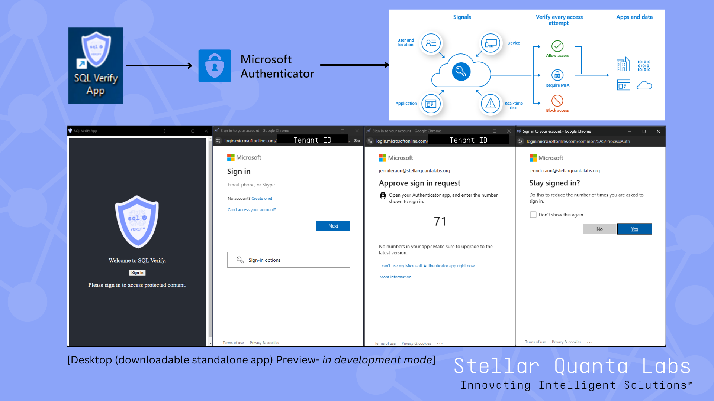

> **Status:** Archived / historical prototype. See **[SQL Verify](https://www.stellarquantalabs.org/sql-verify)** and **[Ghoststamp](https://www.stellarquantalabs.org/ghoststamp)** for current work.

# SQL Verify (DEPRECATED / in-development snapshot)

> This repository contains an **early prototype** of the SQL Verify app.  
> It is **not maintained** and does not reflect the current implementation.

✅ Canonical DID for Stellar Quanta Labs: 

`did:web:stellarquantalabs.org`

📄 DID document is served at:

  `https://stellarquantalabs.org/.well-known/did.json`  
  
  (sourced from `stellarquantalabs.github.io/.well-known/`)
  
🔗 Domain linkage config:  

  `https://stellarquantalabs.org/.well-known/did-configuration.json`

If you’re looking for our current identity & verification work (Entra Verified ID + PQ roadmap), see:
- **Stellar Quanta Labs** SQL Verify Web Page: https://www.stellarquantalabs.org/sql-verify
- **Ghoststamp** Timestamping (active): https://www.stellarquantalabs.org/ghoststamp

---

## Background (snapshot)

SQL Verify began as a React SPA integrating Microsoft Entra Verified ID, MSAL, and Azure Key Vault.  
Architecture (prototype):

### DID

- `did:web:stellarquantalabs.org`  
  Served via our domain: `https://stellarquantalabs.org/.well-known/did.json`  
  Domain linkage: `https://stellarquantalabs.org/.well-known/did-configuration.json`

  - DID Document: https://stellarquantalabs.org/.well-known/did.json  
  - Domain linkage: https://stellarquantalabs.org/.well-known/did-configuration.json

### Status

- This repo is archived / frozen. No releases are planned from this codebase.
- Please do not open issues for feature requests here.
